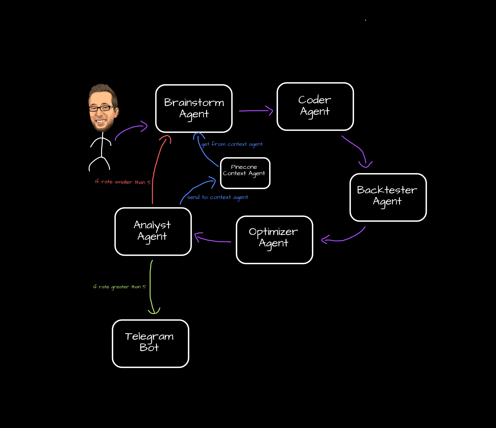

<h1 align="center">
 ⭐ BabyDaviddAGI ⭐

</h1>

A huge thanks @uysalibov how is a coding genius!!

<p align="center">

</p>

Inspired from [@babyagi](https://github.com/yoheinakajima/babyagi).


- The BabyDaviddAGI class is a Python implementation of an Artificial General Intelligence (AGI) system that utilizes OpenAI's GPT model and Pinecone for generating profitable trading strategies. It can brainstorm ideas, generate Python code, perform backtesting, optimize strategies, and analyze results.

## Agents
* **Brainstorm Agent**: Generates brainstorm idea based on user agent
* **Coder Agent**: Generates Python code with using braistorm idea
* **Backtest Agent**: Backtest generated python code using `backtesting.py`
* **Optimize Agent**: Find better settings for generated strategy
* **Analyst Agent**: Analyse all results and give 1-10 point for generated strategy 

### Installation
To use BabyDaviddAGI, you need to install dependencies:
```sh
pip install -r requirements.txt
```

### Telegram Bot Usage
- Add your credenticals to `.env` file
- Run the bot ```python telegramBot.py```

### Example

#### Basic Example
```py
bda = bda = BabyDaviddAGI(
    openai_api_key = "open_ai_key",
    pinecone_api_key = "pinecone_key",
    pinecone_environment = "asia-southeast1-gcp",
    pinecone_table_name = "babydaviddagi",
)
bda.start("RSI-MACD Crossover with MACD Above 20") 
print(bda.idea)
print(bda.code)
print(bda.backtest_result)
print(bda.optimizer_result)
print(bda.analyst_result)
```

- Difference of `start` function is it returns back to `brainstorm_agent` if analyst rate smaller than 5.

#### Initial Task
```py
>>> bda = BabyDaviddAGI(
    openai_api_key = "open_ai_key",
    pinecone_api_key = "pinecone_key",
    pinecone_environment = "asia-southeast1-gcp",
    pinecone_table_name = "babydaviddagi",
)

```

#### Brainstorm Idea
```py
>>> bda.brainstorm_agent("RSI-MACD Crossover with MACD Above 20")
>>> bda.idea
"""One potential trading strategy based on the RSI-MACD Crossover with MACD above 20 could involve identifying stocks with a history of strong momentum and a tendency to trend upward. 
When the MACD line crosses above the signal line and the RSI is above 50, a long position could be taken. 
Conversely, when the MACD line crosses below the signal line and the RSI is below 50, a short position could be taken. 
This strategy could be further optimized by using stop-loss orders to limit potential losses and taking profits at predetermined levels. 
Additionally, monitoring news and market trends could provide valuable insights into potential shifts in stock prices, allowing for quick adjustments to the trading strategy."""
```

#### Generated Code
```py
>>> bda.coder_agent()
>>> bda.code
import warnings
warnings.filterwarnings("ignore")
import talib
from backtesting import Strategy, Backtest
from backtesting.test import GOOG

class RsiMacdCrossover(Strategy):
    # Define indicator variables here which you will give parameter in self.I function.
    n1 = 12
    n2 = 26
    n3 = 9
    n4 = 50
    
    def init(self):
        # Define every indicator here as a class variable in init function. 
        # Don't forget every indicator have to be in self.I function.
        self.macd, self.macd_signal, self.macd_hist = self.I(talib.MACD, self.data.Close, self.n1, self.n2, self.n3)
        self.rsi = self.I(talib.RSI, self.data.Close, self.n4)

    def next(self):
        # Check buy and sell conditions
        # When the MACD line crosses above the signal line and the RSI is above 50, a long position could be taken.
        if self.macd > self.macd_signal and self.rsi > 50:
            self.buy()
        # When the MACD line crosses below the signal line and the RSI is below 50, a short position could be taken.
        elif self.macd < self.macd_signal and self.rsi < 50:
            self.sell()

bt = Backtest(GOOG, RsiMacdCrossover, cash=10_000, commission=.002)
stats = bt.run()

# Print the backtest results
print("Final Equity: ", stats["Equity Final [$]"])
print("Peak Equity ", stats["Equity Peak [$]"])
print("Return Rate: ", stats["Return [%]"])
print("Buy and hold return rate: ", stats["Buy & Hold Return [%]"])
print("Sharpe Ratio: ", stats["Sharpe Ratio"])
print("Max Drawdown Rate: ", stats["Max. Drawdown [%]"])
print("Trade Count", stats["# Trades"])
```

#### Backtest Result
```py
>>> bda.backtester_agent()
>>> bda.backtest_result
"Final Equity:  39931.122 
Peak Equity  40383.622 
Return Rate:  299.31122 
Buy and hold return rate:  703.4582419772772 
Sharpe Ratio:  0.4401023836593147 
Max Drawdown Rate:  -65.2224463139885 
Trade Count 1"
```

#### Optimizer Code
```py
>>> bda.optimizer_agent()
# Add the following code into the backtest code
stats = bt.optimize(n1=range(6, 24, 5), n2=range(13, 52, 5), n3=range(4, 18, 5), n4=range(25, 100, 7))

```

#### Optimizer Result
```py
>>> bda.optimizer_agent()
>>> bda.optimizer_result
"Final Equity:  41182.3528 
Peak Equity  41297.388399999996 
Return Rate:  311.823528 
Buy and hold return rate:  703.4582419772772 
Sharpe Ratio:  0.4605294109801069 
Max Drawdown Rate:  -65.04024963221835 
Trade Count 4
"
```

#### Analyst Result
```js
>>> print(bda.analyst_agent())
{
    'rate': 8, 
    'summary': `The backtest results on original settings show a decent return rate and a positive Sharpe ratio, indicating that the strategy has potential. 
        However, the max drawdown rate is concerning and suggests that the strategy may be risky. 
        The backtest results on optimized settings show a slightly better return rate and Sharpe ratio, but the increase in trade count raises concerns about potential overfitting. 
        Further analysis and testing are needed to determine the effectiveness of this strategy on crypto markets.`
}

```


Made with love by [@uysalibov](https://github.com/uysalibov) for [@DaviddTech](https://www.youtube.com/@DaviddTech).
